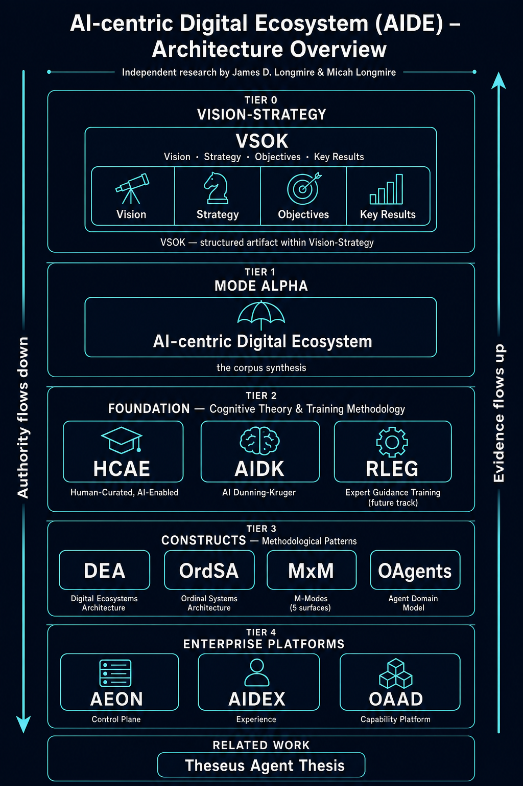

# aide-canon

**AI-centric Digital Ecosystem (AIDE)** — the canonical home for the AIDE corpus. Independent research by **James D. Longmire** (Northrop Grumman Fellow, Chief Architect – Digital Ecosystems; ORCID [0009-0009-1383-7698](https://orcid.org/0009-0009-1383-7698)) and **Micah Longmire** (Sr. AI Architect; ORCID [0009-0006-7608-9322](https://orcid.org/0009-0006-7608-9322)).

This canon consolidates the foundational, methodological, enterprise-altitude, and related work into a single navigable structure. The canon's identity is **AI-centric Digital Ecosystem (AIDE)** — the architectural surface a digitally-realized enterprise must compose to operate trustworthy AI at scale.

> *This canon presents independent research and reflects the views of the authors. It does not represent the position of any employer or program.*

---

*High-level AIDE architecture overview — marketing/communication tier. Canonical architecture diagrams are rendered from construct and platform schemas via ArchiMate + pyArchimate at build time (per ADR-ORDSA-0005). The two tiers coexist with different purposes.*

---

## Canon structure

Five content tiers stratified by altitude and role:

| Tier | Directory | What it holds | Members |
|---|---|---|---|
| **0** | **[`vision-strategy/`](vision-strategy/)** | Umbrella concept — the corpus's enterprise-strategic frame. VSOK is the structured artifact (V/S/O/K methodology) within it | VSOK (Vision · Strategy · Objectives · Key Results) |
| **1** | **[`mode-alpha/`](mode-alpha/)** | The corpus's primary orientation mode — synthesizing argument tying the umbrella to the methodological tiers below (forthcoming) | *AI-centric Digital Ecosystem* synthesis |
| **2** | **[`foundation/`](foundation/)** | Upstream cognitive-theory + training-methodology grounding for the AIDE architecture | HCAE · AIDK · RLEG |
| **3** | **[`constructs/`](constructs/)** | Peer methodological patterns, transverse to altitude | DEA · OrdSA · MxM · OAgents · AICP |
| **4** | **[`enterprise-platforms/`](enterprise-platforms/)** | Enterprise-altitude instantiations of the constructs | AEON · AIDEX · OAAD |
| *—* | **[`related-work/`](related-work/)** | Allied research that informs the canon without being part of its spine | Theseus |
| *—* | **[`patterns/`](patterns/)** | Cross-cutting architectural patterns that traverse multiple tiers/constructs | digital-thread |

Two cross-cutting directories:

- **[`decisions/`](decisions/)** — canon-level Architecture Decision Records (umbrella + structural)
- **[`infographics/`](infographics/)** — canon-level visuals (cross-construct, cross-platform)

The tier numbering was introduced by [ADR-EA-0007](decisions/ADR-EA-0007-introduce-vsok-tier-0-and-mode-alpha.md) — it adds Vision-Strategy as Tier 0 above the synthesis and renames the synthesizing tier from *Master Thesis* to *Mode Alpha*. The shape preserves the four-tier intellectual content from [ADR-EA-0006](decisions/ADR-EA-0006-migrate-corpus-to-aide-canon.md) (foundation / constructs / enterprise-platforms / related-work) and lifts Strategy out of the enterprise-platforms tier into Vision-Strategy / VSOK / Strategy at Tier 0. [ADR-EA-0009](decisions/ADR-EA-0009-introduce-digital-thread-pattern.md) adds the [`patterns/`](patterns/) tier alongside related-work for cross-cutting architectural patterns; the digital-thread pattern is the first entry.

---

## Foundation — the upstream basis

Three artifacts establish the canon's grounding in cognitive-theory and training-methodology. The argument lineage is explicit:

> **[AIDK](foundation/aidk/)** (AI has structural epistemic limits) → **[HCAE](foundation/hcae/)** (so AI work must be human-curated) → **[AIDEX](enterprise-platforms/aidex/)** (architectural expression of HCAE at the experience layer) → **[AEON](enterprise-platforms/aeon/)** (control plane the deployment lives in)

| Artifact | Status | DOI |
|---|---|---|
| **HCAE** — *Human-Curated, AI-Enabled: A Framework for Reliable AI Deployment* | Published | [`10.5281/zenodo.18368697`](https://doi.org/10.5281/zenodo.18368697) |
| **AIDK** — *AI Dunning-Kruger: A Framework for Understanding Structural Epistemic Limitations* | Published | [`10.5281/zenodo.18316059`](https://doi.org/10.5281/zenodo.18316059) |
| **RLEG** — *From RLHF to RLEG: Expert Grounding as a Solution to the Fluency-Calibration Tradeoff* | In draft | (deposit pending) |

RLEG sits adjacent to HCAE: HCAE prescribes human curation of AI output at the practice level; RLEG addresses the training-methodology level — replacing RLHF with Reinforcement Learning from Expert Guidance.

---

## Constructs — five peer methodological patterns

Five methodological constructs sit at the same tier, each patterning a different concern. None subsumes another; they compose:

| Construct | What it patterns | Canonical artifact | DOI |
|---|---|---|---|
| **[DEA](constructs/dea/)** | EA coherence — three-baseline architecture frame (Digital Capability / Digital Technical / Digital Operational baselines, owned by EA / Systems / Solutions architecture disciplines) | `Digital-Ecosystems-Architecture-Base.pdf` (+ UAF + DIB Compliance positioning papers) | [`10.5281/zenodo.20349198`](https://doi.org/10.5281/zenodo.20349198) |
| **[OrdSA](constructs/ordsa/)** | Authority and evidence — seven-ordinal layering (O0 Enterprise Intent → O6 Outcome/Audit/Feedback). Schema-first canonical (`schema/ordsa-0.2.yaml`); prose is companion | `schema/ordsa-0.2.yaml` + concept paper | [`10.5281/zenodo.20334233`](https://doi.org/10.5281/zenodo.20334233) |
| **[MxM](constructs/mxm/)** | Harness — five-surface composition archetype (Mind / Morals / Mission / Memory / Means); applies at any harness altitude, not just per-agent | `Mx-Modes-Technical-Reference.pdf` (JD + Micah Longmire) | [`10.5281/zenodo.20349200`](https://doi.org/10.5281/zenodo.20349200) |
| **[OAgents](constructs/oagents/)** | Agent — behavioral envelope standard + reference implementation; specifies what an agent **is** as a typed object. Schema-first canonical (`spec/oagents-nist-standard-v16.0.md`); paper is companion | `spec/oagents-nist-standard-v16.0.md` | [`10.5281/zenodo.19425021`](https://doi.org/10.5281/zenodo.19425021) |
| **[AICP](constructs/aicp/)** | Identity — Agent Identity Card Protocol; platform-issued Card, phase-gated tool injection, portable cross-platform attestations. Specifies **who** an agent is across platforms and what it has earned. Spec-first (referenced, MIT) | [`ologos-repos/AICP`](https://github.com/ologos-repos/AICP) (`spec/AICP-v0.1.md`) | MIT spec; no Zenodo deposit |

The enterprise-platforms below become **enterprise-altitude instantiations** of these patterns — what you get when you compose MxM (harness) ordered by OrdSA (authority/evidence) within DEA (EA coherence) at enterprise scale, with OAgents as the domain object and AICP as its portable identity.

---

## Enterprise platforms — instantiations at the enterprise altitude

| Platform | Stands for | What it is | DOI |
|---|---|---|---|
| **[AEON](enterprise-platforms/aeon/)** | AI Enterprise Orchestration Nexus | The enterprise control plane for the agentic era. Six service planes: identity, authority, evidence, integration, capability composition, orchestration runtime | [`10.5281/zenodo.20349194`](https://doi.org/10.5281/zenodo.20349194) |
| **[AIDEX](enterprise-platforms/aidex/)** | AI Digital Experience | The worker-facing subdomain under AEON. Architectural expression of HCAE operationally at the digital experience layer | [`10.5281/zenodo.20349196`](https://doi.org/10.5281/zenodo.20349196) |
| **[OAAD](enterprise-platforms/oaad/)** | Open Source Software Agentic AI DevSecOps | A platform thesis: OSS + agentic AI + DevSecOps governance replaces the COTS business capability stack | [`10.5281/zenodo.20349202`](https://doi.org/10.5281/zenodo.20349202) |

**Strategy is not at this tier.** *Enterprise Agentic AI Platform Strategy* — the positioning argument that bridges Vision to the platforms below — lives at [`vision-strategy/vsok/strategy/`](vision-strategy/vsok/strategy/) (Tier 0). It is umbrella prose, not a buildable platform peer. See [ADR-EA-0007](decisions/ADR-EA-0007-introduce-vsok-tier-0-and-mode-alpha.md).

HCAE is **not** an enterprise-platform peer — it sits at `foundation/hcae/` upstream of AIDEX in the argument lineage. AIDEX is the architectural expression at the experience layer; HCAE is the practice discipline AIDEX expresses.

---

## Related work

| Artifact | What it is |
|---|---|
| **[Theseus](related-work/theseus/)** | Micah Longmire's master's thesis on agentic cognitive architecture. Allied research; not part of the AIDE spine but informs the constructs |

---

## Governance

The canon adopts the **OrdSA development process** ratified for the corpus in [ADR-EA-0001](decisions/ADR-EA-0001-adopt-ordsa-development-process.md): `dev` branch + PR flow; append-only ADRs under `decisions/` for substantive decisions; ordinary content PRs for new papers, refinements, infographics. Direct commits to `main` are not permitted.

ADR-worthy triggers and the comment-out period are defined in [CONTRIBUTING.md](CONTRIBUTING.md) (to be added in a follow-on PR). Until then, the canon inherits the same triggers as the source corpus: new construct, construct redefinition, audience/positioning shift, framework alignment claim, license, governance change.

Per Pattern α, each construct and platform's `decisions/` directory holds artifact-internal ADRs; canon-level ADRs (umbrella, structural, governance) live at the root [`decisions/`](decisions/).

The migration from `osa-ai-org/enterprise-ai` to this canon is recorded in [ADR-EA-0006](decisions/ADR-EA-0006-migrate-corpus-to-aide-canon.md).

---

## Suggested reading order

For readers walking the canon top-down:

1. **Vision-Strategy** — read [Strategy](vision-strategy/vsok/strategy/) first for the umbrella positioning argument (pain-first framing, four-plane architecture, staged maturity)
2. **Foundation** — [HCAE](foundation/hcae/) and [AIDK](foundation/aidk/) establish why human curation is structurally necessary
3. **Constructs (foundation methodology)** — [DEA](constructs/dea/) for general-EA coherence; [OrdSA](constructs/ordsa/) for authority/evidence layering
4. **Enterprise platforms** — [AEON](enterprise-platforms/aeon/) (the control plane), [AIDEX](enterprise-platforms/aidex/) (the experience subdomain), [OAAD](enterprise-platforms/oaad/) (the capability platform)
5. **Constructs (harness + agent + identity)** — [MxM](constructs/mxm/) for per-harness orientation; [OAgents](constructs/oagents/) for the agent domain model; [AICP](constructs/aicp/) for portable agent identity
6. **Related work** — [Theseus](related-work/theseus/) for the cognitive-architecture context

---

## License

The canon is licensed under [Creative Commons Attribution 4.0 International (CC BY 4.0)](LICENSE). Where embedded construct repositories carry their own licenses (e.g., OrdSA, OAgents-standard), those licenses apply to their respective subdirectories.

## Citation

Cite individual artifacts by their published DOI where available (foundation tier; per-platform/per-construct Zenodo records as they mint). For the canon as a whole, cite:

> Longmire, J. D., & Longmire, M. (2026). *AI-centric Digital Ecosystem (AIDE) canon* [Software/corpus]. https://github.com/ologos-repos/aide-canon

Per-artifact authorship may differ from corpus-level authorship — some artifacts are sole-authored by one of the co-authors, others jointly. Authorship at the artifact level is recorded at the artifact's location (see e.g. [`constructs/mxm/`](constructs/mxm/) where joint authorship is explicit). See [ADR-EA-0008](decisions/ADR-EA-0008-reframe-corpus-authorship.md) for the corpus-vs-artifact authorship discipline.
