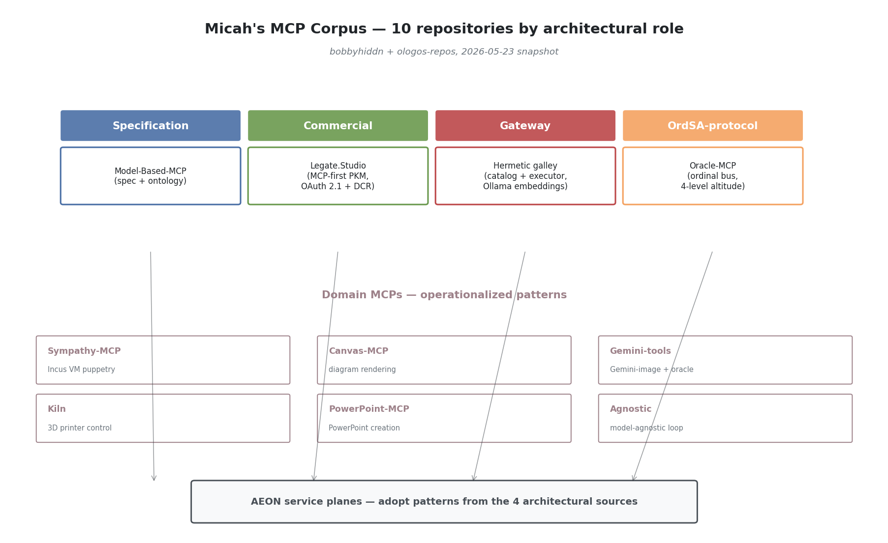
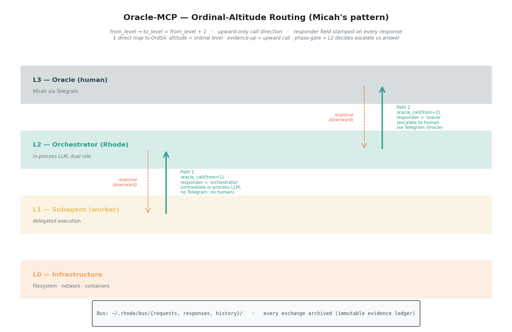
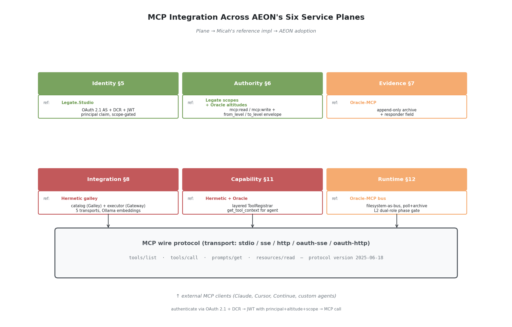
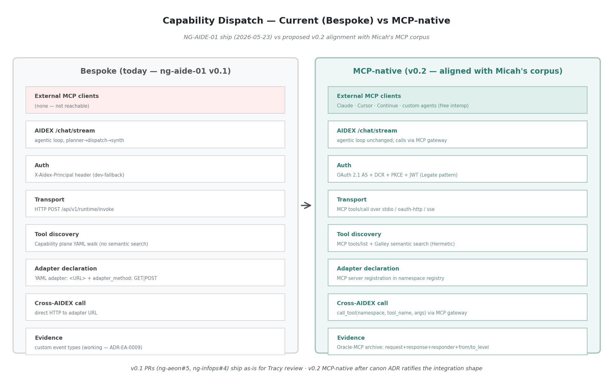
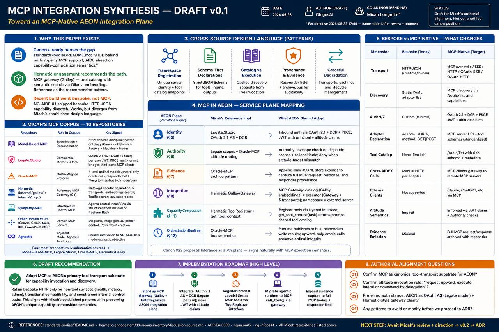

# MCP Integration Synthesis — Draft v0.1

| | |
|---|---|
| **Status** | Draft for Micah's authorial alignment. Not yet a ratified canon position. |
| **Date** | 2026-05-23 |
| **Author (draft)** | OlogosAI |
| **Co-author (pending review)** | Micah Longmire — per his 2026-05-22 17:44 directive (*"let me read it before my name goes on it"*), this paper carries his name only after he reads + approves |
| **Trigger** | NG-AIDE-01 build session 2026-05-23 shipped agentic capability dispatch without MCP. JD's question (*"have we taken into account MCP gateways?"*) surfaced the gap. A survey of Micah's published MCP work shows the gap is substantive — AEON's tool-transport substrate should be MCP-native. |
| **Audience** | AIDE-canon contributors (primary: Micah, JD, Tracy, thinx-Claude) |
| **Out of scope** | Final architectural commitment. This paper is the survey + draft recommendation. The canon-level integration decision is Micah's to author. |

---

## 1. Abstract

NG-AIDE-01's first agentic-orchestration loop (digital-thread pattern materialized as runtime agent loop, per ADR-EA-0009) landed 2026-05-23 with bespoke HTTP-JSON capability dispatch. A survey of Micah Longmire's published MCP work — ten repositories spanning protocol specification (Model-Based-MCP), commercial product (Legate.Studio), reference architecture (Hermetic galley), and OrdSA-aligned protocol design (Oracle-MCP) — reveals that AEON's Integration plane should be MCP-native, not bespoke. This paper inventories the corpus, distills the design language across the four most architecturally substantive sources, maps the patterns onto AEON's six service planes, and proposes integration moves with explicit authorial-alignment questions for Micah to direct. *AIDE behind on first-party MCP support* — as canon already names the gap in [`vision-strategy/analysis/sota-survey/standards-bodies/README.md`](../sota-survey/standards-bodies/README.md) — is closeable by adopting the patterns Micah has already published rather than by inventing parallel ones.

---

## 2. Why this paper exists

Three threads converge:

**Canon already names the gap.** [`standards-bodies/README.md`](../sota-survey/standards-bodies/README.md) explicitly tracks MCP and assigns it to *"AEON capability plane + tool integration"* with the status line *"AIDE behind on first-party MCP support; AIDE ahead on capability-composition semantics."* This is canon's own acknowledgement that MCP needs to come into AEON.

**Hermetic engagement notes single out the MCP gateway as a recommended-impl reference.** [`hermetic-engagement/39-means-inventory/discussion-source.md`](../hermetic-engagement/39-means-inventory/discussion-source.md) item #7: *"MCP gateway (Galley) — tool catalog with semantic search via Ollama embeddings. AEON integration plane connects to external tools; Galley is the catalog/proxy. Reference as the recommended pattern."* Canon's path is clear; the implementation reference is named.

**Recent NG-AIDE-01 build went bespoke, not MCP.** The 2026-05-23 build of Runtime plane v0.1 + agentic chat loop on NG-InfOps ([ng-aeon#5](https://github.com/ologos-corp/ng-aeon/pull/5), [ng-infops#4](https://github.com/ologos-corp/ng-infops/pull/4)) implements capability dispatch as bespoke HTTP-JSON over a custom `/api/v1/runtime/invoke` endpoint. The capability YAML uses an `adapter: <URL>` field with `adapter_method: GET|POST`. No MCP server, no MCP client, no MCP discovery. The bespoke pattern works end-to-end (live-tested against Tracy's LM Studio) but diverges from Micah's established design language.

This paper is the survey + draft recommendation layer that closes the gap at the canon level. Final direction must be Micah's per his authorship discipline; the analysis here is offered as the substrate for his decision.

---

## 3. Micah's MCP corpus — inventory

Ten repositories across `bobbyhiddn` (personal) and `ologos-repos` (organization), spanning specification, commercial product, infrastructure, and domain-specific MCP servers. This is one of the more substantive single-author MCP corpora in the ecosystem.

| Repo | Role in corpus | Most relevant signal |
|---|---|---|
| [`bobbyhiddn/Model-Based-MCP`](https://github.com/bobbyhiddn/Model-Based-MCP) | Specification + documentation reference | Strict schema discipline; nested-container ontology (Canvas > Network > Factory > Machine > Node) with consistent identity contract at every level |
| [`ologos-repos/Legate.Studio`](https://github.com/ologos-repos/Legate.Studio) | Commercial MCP-first PKM | **OAuth 2.1 AS + Dynamic Client Registration**; protocol version `2025-06-18`; per-user JWT tokens; PKCE enforced; 43-tool surface; multi-tenant; bridges third-party MCP clients (Claude, ChatGPT) without exposing upstream IdP tokens |
| [`bobbyhiddn/Oracle-MCP`](https://github.com/bobbyhiddn/Oracle-MCP) | OrdSA-aligned protocol pattern | **4-level ordinal model** (L0 Infra, L1 Subagent, L2 Orchestrator, L3 Oracle); upward-only oracle calls; explicit `responder` field as protocol-level provenance; filesystem-as-bus at `~/.rhode/bus/{requests,responses,history}` |
| [`ologos-repos/Hermetic`](https://github.com/ologos-repos/Hermetic) (`internal/galley/` + `internal/mcp/`) | Reference MCP gateway impl (Go) | **Catalog/Executor separation** (Galley = catalog, Gateway = executor); five transports (stdio, sse, http, oauth-sse, oauth-http); Ollama embeddings for semantic tool search; layered `ToolRegistrar` interface; lazy expand / explicit collapse subprocess lifecycle |
| [`bobbyhiddn/Sympathy-MCP`](https://github.com/bobbyhiddn/Sympathy-MCP) | Infrastructure-control MCP | Agents puppeteer Incus VMs via structured tools (`vm_exec`, `vm_file_*`, `vm_snapshot`) instead of freeform Bash — pattern for replacing shell with MCP at the agent boundary |
| [`bobbyhiddn/Canvas-MCP`](https://github.com/bobbyhiddn/Canvas-MCP) | Domain MCP (diagrams) | Tool transport for diagram-rendering capability; precursor to Model-Based-MCP |
| [`bobbyhiddn/Gemini-tools`](https://github.com/bobbyhiddn/gemini-tools) | Domain MCP (image gen + oracle) | Gemini 3.1 Pro Preview wrapped as MCP tools |
| [`bobbyhiddn/Kiln`](https://github.com/bobbyhiddn/Kiln) | Domain MCP (3D printer control) | Public successful MCP server; pattern for physical-device control over MCP |
| [`bobbyhiddn/PowerPoint-MCP`](https://github.com/bobbyhiddn/PowerPoint-MCP) | Domain MCP (office productivity) | stdio MCP for PowerPoint creation |
| [`bobbyhiddn/Agnostic`](https://github.com/bobbyhiddn/Agnostic) | Adjacent — model-agnostic tool loop | Parallel motivation to NG-AIDE-01's O8 model-agnostic objective; worth reading before deepening the inference-gateway work |

The corpus splits cleanly by *role*: one specification (Model-Based-MCP), one commercial reference (Legate), one infrastructure pattern (Hermetic galley), one OrdSA-aligned protocol (Oracle-MCP), and six domain-specific MCP servers. The four sources read deeply in this paper are the four non-domain ones — they carry the architectural pattern Micah has been refining.

---

## 4. Four sources read in depth

### 4.1 Model-Based-MCP — ontology discipline + schema rigor

**What it is.** An MCP server for canvas-style architectural diagrams. The diagrams use a strict 4-level nested-container ontology — Canvas > Network > Factory > Machine > Node — with consistent identity semantics at every level (`id`, optional `label`, `get_label()` fallback).

**Vocabulary worth lifting.**
- **Recipe** — the YAML input that defines a diagram. Not "spec," not "config." Distinct from execution; the recipe describes intent.
- **Ontology** — used in code header (`models.py`: *"the canvas and SysML/MBSE ontology"*). Treated as first-class.
- **Style** vs. **Type** — `type` carries domain meaning (color + semantics); `style` is a pure override layer. Separates *what something is* from *how it appears*.

**Architectural positions.**
- Transport: stdio only. MCP SDK `Server` primitive (low-level).
- Tool surface: exactly 4 — `render_model`, `create_model`, `list_templates`, `get_template`. Two input modes per tool (raw recipe vs. structured args) so the same operation can be driven by an LLM or by a human/file.
- Schema discipline: every tool exposes full JSON Schema with `enum` constraints on `type`, `spacing_level`, `orientation`. No silent string fields. Errors returned as structured JSON results with `status: "success"`, not protocol errors.
- State: outputs under `~/.rhode/canvas/`. (Inference: `~/.rhode/` is treated as the canonical agent state root across multiple Micah MCPs — see also Oracle-MCP.)

**OrdSA parallels.**
- The nested-container ontology *is* an altitude hierarchy of a different kind (containment, not authority). The doctrine *"every level exposes the same identity contract"* maps directly to OrdSA's *"every altitude exposes the same evidence-up interface."*

**Reusable patterns for AEON.**
- The id + optional label + `get_label()` fallback as a universal addressing contract.
- Two-input-mode tool design (recipe vs. structured args).
- Auto-detection of higher containers from leaf-level connectivity (`_auto_detect_machines` from node inputs/outputs) — *"infer structure from edges when explicit structure is omitted."*

### 4.2 Oracle-MCP — ordinal-altitude protocol semantics

**What it is.** An MCP server implementing an **oracle communication bus** for the Rhode agent system. Agents at level N can issue oracle calls to level N+1; the bus routes each call to the right responder based on the caller's ordinal level. Rhode (L2) answers L1 subagent calls itself using its own LLM; when Rhode itself needs guidance, it escalates L2→L3 to the human operator via Telegram.

**This is the most OrdSA-aligned source by a wide margin.** It is the cleanest implementation of authority-altitude semantics in any AI repo currently public.

**Vocabulary.**
- **Ordinal levels** — canonical naming: L0 Infrastructure, L1 Subagent, L2 Orchestrator, L3 Oracle.
- **Oracle call** — the protocol's atomic verb. Always upward (`to_level = from_level + 1`).
- **Bus** — file-based JSON message substrate at `~/.rhode/bus/{requests,responses,history}`.
- **Responder** — explicit field on responses: `"orchestrator"` (peer agent answered) or `"oracle"` (human answered). The protocol surfaces *who* answered to the caller.
- **Dual role** — Rhode is "both agent and oracle" depending on direction of the call. This is the central architectural insight: a single node can occupy multiple altitudes simultaneously, with the protocol disambiguating per-call.

**Architectural positions.**
- MCP is a thin facade over a filesystem-based message queue. The bus itself is the durable transport; MCP is just the operator-grade tool surface.
- Routing logic is declarative — `to_level = from_level + 1` is computed.
- Lifecycle: poll-based (2-second interval) with timeout (300s default). Timed-out requests are explicitly archived with `status: "timeout"` — never silently dropped.
- Auth: none at the MCP layer. Trust boundary is the filesystem itself.
- Evidence emission is *complete*: every exchange produces `request_*.json + response_*.json` archived under `~/.rhode/bus/history/<timestamp>/`. The archive is the audit log.
- Reboot continuity: `rhode-reboot` writes a "continuation prompt" to `~/.rhode/reboot_prompt.json` before restarting. Persistence across process death is a first-class concern.

**OrdSA parallels (direct).**
- `from_level` / `to_level` *are* altitude-of-caller / altitude-of-target.
- Upward-only call direction mirrors *"evidence flows up, authority flows down"* — you can only *ask* upward.
- The L2 dual role (Rhode answers L1 calls itself, escalates L2→L3 to human) is the **phase-gate pattern**: the orchestrator decides whether a call deserves human attention, with the option to *tell the subagent to re-ask at L2.*
- `responder` field = protocol-level provenance of judgment authority.
- Archive = immutable evidence ledger.

**Reusable patterns for AEON.**
- Filesystem-as-bus for local-host agent coordination — atomic, debuggable (`cat ~/.rhode/bus/requests/*.json`), zero dependency footprint.
- Polling + archive lifecycle as alternative to long-lived connections.
- `responder` and `urgency` (4-value enum: `low|normal|high|critical`) as protocol-level metadata that agents can reason about.
- Fire-and-forget mode (`--no-wait`) for notifications — same protocol, different waiting policy.

### 4.3 Hermetic galley + mcp — catalog/gateway separation

**What it is.** Hermetic's `internal/galley/` (catalog) + `internal/mcp/` (server) provide a production-grade MCP gateway in Go. Galley aggregates MCP tools from multiple external MCP servers, indexes them with Ollama embeddings for semantic search, and exposes a single MCP surface that proxies calls to the right backend.

**Vocabulary.**
- **Galley** — *"the CATALOG, not the executor"* (`galley.go:1-9`). Strong domain noun.
- **Gateway** — the separate concern that *executes* MCP calls against external servers. Galley wraps Gateway.
- **Namespace** — unit of MCP-server grouping. One namespace = one external MCP server; tools keyed `(namespace, tool_name)`.
- **Expand** / **Collapse** — lifecycle verbs for namespace subprocess management.
- **ToolRegistrar** — Go interface each subsystem implements to register tools; Hermetic has a *layered* MCP server where multiple subsystems each contribute their tool surface.
- **Scan** — discovery operation (expand → catalog → collapse).
- **Catalog vs. live** — explicit distinction throughout the code. The catalog is what the system *believes* tools to be; an actual `call_tool` produces fresh evidence.

**Architectural positions.**
- Five supported transports (`gateway.go:42-47`): `stdio`, `sse`, `http`, `oauth-sse`, `oauth-http`. Per-transport validation in `ServerConfig.Validate()`.
- OAuth: pre-acquired token only (*"Browser-callback OAuth flow is intentionally out of scope here — bring your own token"*). Explicitly complementary to Legate's full-OAuth-AS stance.
- Persistence: server configs in SQLite `namespace_servers`; tool catalog in `galley_namespaces` + `galley_tools`; embeddings as BLOB.
- Embeddings: Ollama `nomic-embed-text` (768-dim), explicitly cross-language compatible with Python's `struct.pack("<768f", ...)`. Graceful degradation to keyword search when Ollama unreachable.
- Concurrency: `sync.RWMutex` on process map; double-check pattern in `ExpandNamespace`.
- Connection lifecycle: lazy expand on `CallTool`, explicit `collapse_namespace` for teardown.
- Tool naming: dynamic `expand_<ns>` tools generated at server boot, one per registered namespace.

**Tool surface (`tools.go`)** — 8 static + N dynamic:
`search_tools` (semantic search) · `register_namespace` · `scan_namespace` / `scan_all_namespaces` · `list_registered` · `get_tool_context` (formatted markdown block of relevant tools for a task — *prompt-shaped output, not just data*) · `call_tool` (proxied invocation) · `collapse_namespace` · `expand_<ns>` (one per namespace, cached catalog view).

**OrdSA parallels.**
- Namespace as authority domain — each external MCP server is a separately-trusted authority surface; the gateway is the **integration plane** brokering between altitudes of trust.
- Catalog vs. live = belief vs. evidence (Mind module's belief revision cycle made operational).
- `get_tool_context` returning a prompt-shaped block is evidence-up shaped for *agent consumption* — not just data.
- `RegisteredToolNames()` + sorted output — auditable inventory at any point in time.

**Reusable patterns for AEON.**
- **Catalog/Executor separation** as integration-plane architecture.
- **Layered ToolRegistrar** for composable MCP server: each plane / subdomain registers its tools through the same interface.
- **MCP-tool-of-MCP-tools**: `call_tool(namespace, tool_name, arguments)` as the proxy primitive — the cleanest known pattern for "AEON exposes everything it can do" without leaking implementation boundaries.
- **Graceful degradation as coding norm** — Ollama unreachable → return `(nil, nil)`, caller falls back to keyword. Never panic, never block.

### 4.4 Legate.Studio — production OAuth 2.1 + MCP-first

**What it is.** A commercial MCP-first PKM (personal knowledge management) platform. Per the README: *"Your second brain — backed by GitHub, served by Flask, secured by design. Supports shared libraries for collaborative knowledge sharing, a full MCP integration for Claude, and a draft/merge workflow for team contributions."*

The most production-hardened MCP server in Micah's corpus, and the canonical reference for *inbound* third-party MCP authentication.

**Vocabulary.**
- **Pit** — internal codename for the Legate runtime.
- **Legato** — legacy code-name still in env vars (`LEGATO_MODE`) and DB names (`legato.db`).
- **Connector** — Anthropic's term for an HTTP MCP server, adopted as Legate's user-facing terminology.
- **Library** / **Shared library** / **Personal library** — multi-tenant terminology over notes.
- **Draft & Merge workflow** — collaborators write drafts, owners merge. Explicit governance vocabulary.
- **Confidence bucketing** — search results split high-confidence vs. maybe-related. Surface calibration in the protocol.

**Architectural positions.**
- Transport: HTTP with JSON-RPC 2.0. `MCP-Protocol-Version: 2025-06-18` header.
- Server capabilities: `tools`, `resources`, `prompts`, each with `listChanged: False`.
- **Auth: OAuth 2.1 AS + Dynamic Client Registration (RFC 7591 + RFC 8414).** This is the canonical pattern Micah has chosen for the spec-current MCP world:
  - Discovery: `/.well-known/oauth-authorization-server`
  - DCR: `POST /oauth/register` → returns `{client_id: "mcp-<hex>", client_secret: ""}` (public client)
  - PKCE enforced (S256 only)
  - Auto-registration of trusted clients (Claude, ChatGPT) by redirect-URI matching
  - JWT tokens minted by Pit (NOT GitHub tokens) — *"Claude never sees your GitHub token"*
  - Token TTL: 1 hour
  - Scopes: `mcp:read`, `mcp:write` (only two)
- Multi-tenant: per-user SQLite DBs (`legato.db`, `agents.db`, `chat.db`); JWT carries `user_id` claim; `get_user_legato_db()` returns per-user connection.
- Rate limiting: per-user keying via JWT, 1000/hour. `get_mcp_user_id()` returns `f"mcp:{user_id}"` so Flask-Limiter sees it pre-request.
- WAL checkpointing after writes: explicit `PRAGMA wal_checkpoint(RESTART)` for cross-worker visibility in multi-gunicorn deployments.
- Tool surface: **43 tools**. Organized by domain. `library_id` parameter on every tool; `check_write_permission()` enforces draft & merge for non-owners; per-tool per-tier gating (`require_managed_tier`).
- Embedding model abstraction: Gemini default (768-dim) → OpenAI (1536-dim) → Ollama. Auto-detect chain.

**OrdSA parallels.**
- OAuth scopes as authority tokens — `mcp:read` / `mcp:write` are altitude markers; an L2 orchestrator gets write, a public L1 client might get only read.
- **Draft & Merge workflow is exactly a phase gate.** Collaborators submit (produce evidence), owners decide (exercise authority). The protocol enforces it.
- Per-tier gating is authority-altitude check at the tool boundary.
- JWT `user_id` claim → per-user DB = identity-plane → evidence-plane partitioning.

**Reusable patterns for AEON.**
- **OAuth 2.1 + DCR as MCP auth canon** — Legate is the reference implementation; aligns with Anthropic's June 2025 protocol spec.
- **JWT bridging** — don't expose upstream IdP tokens to the MCP client; mint your own with the principal claim → per-principal capability scoping.
- **Per-call `library_id` parameter** for multi-tenant tool reuse — same tool surface, scope-shifted per call.
- **`isError: true` on tool results** for soft failures (MCP-spec-compliant).
- **WAL checkpoint after every MCP write** for SQLite multi-worker deployments.
- **Confidence-bucketed search results** — gives the agent a calibration signal.

---

## 5. Cross-source synthesis

### Shared design language

1. **"Namespace" as the unit of MCP-server registration** (Hermetic explicit; Legate uses "library" similarly as multi-tenant unit).
2. **Schema-first tool declarations** with strict JSON Schema + enums. All four sources avoid free-form string params where an enum is possible.
3. **Catalog/cache separation from live execution** — Hermetic explicit (Galley vs. Gateway); Legate caches embeddings; Oracle-MCP archives every exchange; Model-Based-MCP caches templates.
4. **`~/.rhode/` as canonical agent home** — appears in Oracle-MCP (`~/.rhode/bus/`) and Model-Based-MCP (`~/.rhode/canvas/`). Inferred convention; worth ratifying canon-level.
5. **Provenance fields on results** — Oracle-MCP's `responder`, Legate's `match_types` + confidence buckets, Hermetic's `score`. Agents are told *how* a result was produced.
6. **Graceful degradation as norm** — Hermetic on Ollama, Legate on embedding-provider chain, Oracle-MCP on timeout-with-archive. No source treats dependency failure as a panic.

### Tensions / design variations

| Concern | Oracle-MCP | Model-Based-MCP | Hermetic | Legate |
|---|---|---|---|---|
| Transport | stdio | stdio | stdio + sse + http + oauth-* | HTTP only |
| Auth | none (local) | none (local) | bring-your-own static token | OAuth 2.1 AS + DCR + JWT |
| Multi-tenant | no | no | namespace-scoped, single user | first-class per-user DBs |
| State | filesystem JSON | filesystem PNG | SQLite | SQLite (multi-DB) |
| Tool count | 5 | 4 | 8 + N | 43 |
| Role in stack | bus | tool | gateway | server |

**The auth axis has the widest spread.** Oracle-MCP assumes filesystem trust; Hermetic assumes you-bring-a-token; Legate is a full OAuth Authorization Server. **There is no single Micah-canonical auth pattern** — the choice tracks deployment surface (local agent ↔ integration broker ↔ multi-tenant SaaS).

Hermetic's stance (*"browser-callback OAuth flow is intentionally out of scope here"*) and Legate's stance (*"we ARE the OAuth AS"*) are **explicitly complementary**: Hermetic is a *client-side* gateway brokering to external servers; Legate is a *server-side* tool host accepting third-party clients. AEON needs both roles.

---

## 6. Mapping to AEON service planes

Per AEON white paper §5–§12 (six planes; v0.1 minimal-coherent subset is Identity + Authority + Evidence; full subset adds Integration + Capability Composition + Orchestration Runtime; canon #23 proposes Inference as a 7th plane).

| Plane | Micah's reference impl | What AEON should adopt |
|---|---|---|
| **Identity (§5)** | Legate.Studio OAuth 2.1 AS + DCR | Inbound: third-party MCP clients authenticate via OAuth 2.1 + DCR + PKCE; JWT minted by AEON with `principal` + `altitude` claims |
| **Authority (§6)** | Legate scopes (`mcp:read`/`mcp:write`) + per-tier gating; Oracle-MCP altitude routing | Authority envelope check on capability dispatch reads OAuth scopes + caller altitude from JWT; deny when altitude-target mismatch (you can only invoke capabilities at-or-above your altitude) |
| **Evidence (§7)** | Oracle-MCP archive pattern (`~/.rhode/bus/history/`) | Append-only JSONL store already shipped (per ADR-EA-0009); extend to capture full MCP request + response bodies + `responder` field stamped at protocol level |
| **Integration (§8)** | Hermetic galley/gateway | AEON Integration plane *is* an MCP gateway: catalog (Galley pattern with embeddings) + executor (Gateway pattern with five transports); namespace = external MCP server; `call_tool(namespace, tool_name, arguments)` is the canonical dispatch shape |
| **Capability Composition (§11)** | Hermetic's `RegisterTools` + `get_tool_context` | Capabilities registered via layered `ToolRegistrar`-style interface (each subdomain orchestrator registers its tools); `get_tool_context(task_description)` returns prompt-shaped tool catalog for agent consumption (Galley pattern) |
| **Orchestration Runtime (§12)** | Oracle-MCP bus pattern | Inter-agent dispatch uses the filesystem-as-bus + poll-and-archive pattern; `from_level`/`to_level` carried at protocol level; L2 dual-role (peer answers vs. escalate upward) is the canonical phase-gate |
| **Inference (proposed §13, canon#23)** | (out of scope for this paper) | — |

**Single sentence summary of the mapping:** *AEON's Identity plane uses Legate's OAuth; Authority uses Legate's scopes + Oracle's altitudes; Evidence uses Oracle's archive; Integration uses Hermetic's gateway; Capability uses Hermetic's catalog; Runtime uses Oracle's bus.*

---

## 7. Current bespoke state vs. MCP-native — what changes

What we shipped 2026-05-23 (bespoke) vs. what an MCP-native AEON would look like:

| Layer | Bespoke (today, in ng-aide-01 PRs) | MCP-native (proposed) |
|---|---|---|
| Transport | HTTP-JSON `POST /api/v1/runtime/invoke` with bespoke `{capability_id, principal, input}` schema | MCP `tools/call` over chosen transport (stdio for local, oauth-http for external) |
| Tool discovery | Capability plane walks YAML, returns `(id, source_path)` tuples | MCP `tools/list` returns standard `[{name, description, inputSchema}, ...]` |
| Auth | `X-Aidex-Principal` header from dev-fallback string | OAuth 2.1 + DCR + JWT with `principal` claim + scope-gated by `mcp:*` |
| Adapter declaration | YAML `adapter: <URL>` + `adapter_method: GET|POST` | MCP server registration in namespace registry; tools auto-discovered via `tools/list` |
| Catalog | YAML walk, no semantic search | Hermetic-galley-style: embedded tool descriptions, semantic search via `search_tools(query)` |
| Cross-AIDEX call | Direct HTTP to adapter URL | Through MCP gateway: `call_tool(namespace="ng-infops", tool_name="list-pending-ratifications", arguments={})` |
| External client compatibility | Zero — Claude / Cursor / Continue cannot call AEON capabilities | Full — any MCP client can authenticate via DCR + invoke capabilities |
| Altitude semantics | Not surfaced | `from_level` / `to_level` carried at protocol level per Oracle-MCP |
| Evidence emission | Custom `inference.chat_completion` + `capability.invoked` + `agent.completion` events | Standard MCP request/response archived + Oracle-MCP-style `responder` field |

**What survives unchanged.** The Evidence plane impl (append-only JSONL, query, chain reconstruction) is reusable. The Capability plane's YAML registry can become the MCP namespace registry source-of-truth. The OrdSA discipline (altitudes, phase gates, evidence-up) becomes more enforceable, not less, because OAuth scopes and Oracle-MCP altitudes give the protocol something to inspect.

**What gets thrown away.** The bespoke `/api/v1/runtime/invoke` endpoint shape; the `X-Aidex-Principal` header convention; the `adapter:` URL pattern in capability YAML. These were ~3 hours of code; not a meaningful sunk cost.

---

## 8. Recommendations (draft, for Micah to direct)

1. **Adopt MCP as AEON's primary tool-transport substrate.** Where AEON capabilities are invoked, MCP is the wire protocol. Bespoke HTTP-JSON allowed only for non-tool surfaces (health probes, metrics, internal admin).

2. **Hermetic galley becomes the canon-referenced MCP gateway impl.** AEON Integration plane points at `ologos-repos/Hermetic/internal/galley/` as the reference pattern. AEON's own gateway is either a direct adaptation or a vendored module.

3. **Legate's OAuth 2.1 + DCR pattern is canon-referenced for inbound MCP auth.** AEON Identity plane exposes `/.well-known/oauth-authorization-server` and `/oauth/register` per Legate; JWT minted by AEON carries `principal` + `altitude` + scope.

4. **Oracle-MCP's ordinal-bus pattern is canon-referenced for L1↔L2↔L3 evidence/authority flow.** AEON Orchestration Runtime adopts `from_level` / `to_level` + `responder` field at protocol level; archive at `<state-dir>/bus/history/` follows the Oracle-MCP layout.

5. **Stage the migration.** ng-aide-01 PRs already in flight (#5, #4) stay bespoke; merged after Tracy's review for v0.1 ship. v0.2 ships MCP-native. Canon-side decisions (this paper → ratified ADR → v0.2 spec) precede v0.2 build.

6. **Open authoring questions for Micah** (next section) decided before v0.2 build starts.

---

## 9. Open authorial-alignment questions for Micah

Numbered; one-letter answers suffice. Free-text override at any prompt is welcome.

**Q1. Is the corpus inventory complete?**
- a. Yes — these 10 are the substantive MCP-authored set
- b. Add specific repos I missed (please name)
- c. Some of these aren't representative — flag which and why

**Q2. Adoption of MCP as AEON's primary tool-transport substrate (Recommendation #1).**
- a. Endorse as-stated
- b. Endorse with scope qualifications (please specify)
- c. Defer — MCP-as-canonical needs more deliberation
- d. Disagree — bespoke is the right call; please share why

**Q3. Hermetic galley as canon-referenced MCP gateway (Recommendation #2).**
- a. Endorse galley + gateway as the reference pattern AEON adapts/vendors
- b. Endorse but with adaptation notes (please specify what changes for AEON)
- c. Galley is one impl among several — point at it as exemplar without "canonical" framing
- d. Different gateway approach preferred (please describe)

**Q4. Legate's OAuth 2.1 + DCR as inbound auth canon (Recommendation #3).**
- a. Endorse — AEON Identity plane mirrors Legate's pattern
- b. Endorse but Legate's specifics differ from what AEON needs (please specify)
- c. AEON should use a different auth model — please describe

**Q5. Oracle-MCP ordinal-bus as inter-agent transport canon (Recommendation #4).**
- a. Endorse — `from_level`/`to_level`/`responder` become AEON protocol-level fields
- b. Endorse the pattern but use a different transport (please specify; maybe shared queue instead of filesystem?)
- c. Oracle-MCP is Rhode-specific — don't promote it to AEON-canonical
- d. Different ordinal model preferred (please describe)

**Q6. `~/.rhode/` as canonical agent state-root convention.**
- a. Confirm — `~/.rhode/` is the agent home directory; canon ratifies
- b. Rename — the agent home should be something else (please name; `~/.aide/`? `~/.aeon/`?)
- c. Per-agent — each agent has its own state-root, no shared convention
- d. Open — TBD with the team

**Q7. Migration staging (Recommendation #5).**
- a. Endorse — ng-aide-01 v0.1 ships bespoke (Tracy reviews; merge as-is); v0.2 MCP-native after canon ratifies
- b. Pause ng-aide-01 PRs and redo MCP-native first
- c. Different staging (please describe)

**Q8. Who authors the AEON-MCP integration spec?**
- a. Micah (you) author it; OlogosAI drafts based on this paper for your review
- b. OlogosAI authors; Micah reviews + approves
- c. JD + Micah co-author with OlogosAI drafting
- d. Tracy is integration-plane lane lead per ng-aide-01 CONTRIBUTING.md — he authors
- e. Other (please specify)

**Q9. Authorship of this paper.**
- a. You're a co-author once you've read + revised — paper carries OlogosAI + Micah Longmire when ratified
- b. You're an authorial reviewer — paper carries OlogosAI as sole author with explicit acknowledgement of your published corpus
- c. Paper is canon-scaffolding only — no formal authorship; lives as an analysis artifact
- d. Other framing (please specify)

**Q10. Anything missing from this paper that would change the recommendation?**

---

## 10. Implementation roadmap sketch (draft, post-Q-resolution)

Pending Q1–Q10 resolution. Sketched here for shape only:

| Phase | Deliverable | Who | Gating |
|---|---|---|---|
| 0 (now) | This paper → Discussion thread → Micah reads | OlogosAI drafts; Micah reads | none |
| 1 | Ratified ADR — *"MCP is AEON's primary tool-transport substrate"* with the patterns from §6 cited | Per Q8 | Q1–Q9 resolved |
| 2 | AEON-MCP integration spec — Identity / Authority / Evidence / Integration / Capability plane interfaces in MCP terms | Per Q8 | Phase 1 ADR ratified |
| 3 | NG-AIDE-01 v0.2 build — MCP server in Integration plane; OAuth 2.1 AS in Identity plane; ordinal-bus in Runtime plane | Tracy (InfOps) + OlogosAI (AEON) | Phase 2 spec ratified |
| 4 | Migrate ng-infops capability to MCP server registration; deprecate bespoke `/api/v1/runtime/invoke` | Tracy + OlogosAI | Phase 3 substrate live |

---

## 11. References

### Canon (this repo)
- [`vision-strategy/analysis/sota-survey/standards-bodies/README.md`](../sota-survey/standards-bodies/README.md) — MCP gap explicitly named
- [`vision-strategy/analysis/hermetic-engagement/39-means-inventory/discussion-source.md`](../hermetic-engagement/39-means-inventory/discussion-source.md) — Galley as recommended-impl reference
- [`vision-strategy/analysis/aide-vocabulary-map.md`](../aide-vocabulary-map.md) — MCP-as-MxM-Means mapping
- [`patterns/digital-thread.md`](../../../patterns/digital-thread.md) — Digital-thread + MCP tool exposure
- [`decisions/ADR-EA-0009-introduce-digital-thread-pattern.md`](../../../decisions/ADR-EA-0009-introduce-digital-thread-pattern.md)
- [`related-work/theseus/The-Theseus-Agent-Thesis.md`](../../../related-work/theseus/The-Theseus-Agent-Thesis.md) — AICP positioned above MCP

### Micah's MCP corpus
- [`bobbyhiddn/Model-Based-MCP`](https://github.com/bobbyhiddn/Model-Based-MCP) — spec + ontology
- [`bobbyhiddn/Oracle-MCP`](https://github.com/bobbyhiddn/Oracle-MCP) — ordinal-altitude oracle bus
- [`bobbyhiddn/Sympathy-MCP`](https://github.com/bobbyhiddn/Sympathy-MCP) — VM puppetry
- [`bobbyhiddn/Canvas-MCP`](https://github.com/bobbyhiddn/Canvas-MCP) — diagram MCP precursor
- [`bobbyhiddn/Gemini-tools`](https://github.com/bobbyhiddn/gemini-tools) — Gemini wrapped as MCP
- [`bobbyhiddn/Kiln`](https://github.com/bobbyhiddn/Kiln) — 3D printer MCP
- [`bobbyhiddn/PowerPoint-MCP`](https://github.com/bobbyhiddn/PowerPoint-MCP) — PowerPoint MCP
- [`bobbyhiddn/Agnostic`](https://github.com/bobbyhiddn/Agnostic) — model-agnostic tool loop
- [`ologos-repos/Legate.Studio`](https://github.com/ologos-repos/Legate.Studio) — production OAuth 2.1 + MCP
- [`ologos-repos/Hermetic`](https://github.com/ologos-repos/Hermetic) — `internal/galley/` + `internal/mcp/`

### NG-AIDE-01 context (this gap surfaced from)
- [ng-aide-01#15](https://github.com/ologos-corp/ng-aide-01/issues/15) — NG-AIDE-01 umbrella
- [ng-aeon#5](https://github.com/ologos-corp/ng-aeon/pull/5) — Runtime plane v0.1 (bespoke dispatch)
- [ng-infops#4](https://github.com/ologos-corp/ng-infops/pull/4) — Agentic loop (bespoke chat)
- [aide-canon#23](https://github.com/ologos-repos/aide-canon/issues/23) — Inference plane 7th-plane proposal

---

*Draft v0.1 closes here. Next revision driven by Micah's responses to §9. Diagrams in [`diagrams/`](diagrams/).*

---

## Appendix A: MCP Integration Synthesis — Visual Overview

*Poster by JD — a single-page visual companion to this paper, mapping the synthesis across eight sections.*

The poster distills this paper's analysis into a visual reference suitable for print or screen review. Its eight sections correspond to the paper's major threads:

1. **Why This Paper Exists** — The three converging threads (canon names the MCP gap, Hermetic engagement recommends the gateway, NG-AIDE-01 build went bespoke) that motivated this synthesis. Corresponds to §2.

2. **Micah's MCP Corpus — 10 Repositories** — Visual inventory of the ten repos spanning specification, commercial product, infrastructure, and domain-specific MCP servers. The four most architecturally substantive sources (Model-Based-MCP, Legate.Studio, Oracle-MCP, Hermetic) are highlighted. Corresponds to §3.

3. **Cross-Source Design Language Patterns** — The six shared design-language elements distilled across the four deep-read sources: namespace registration, schema-first declarations, catalog/cache separation, `~/.rhode/` as agent home, provenance fields on results, and graceful degradation. Corresponds to §5.

4. **MCP in AEON Service Plane Mapping** — The core integration table mapping each AEON service plane (Identity, Authority, Evidence, Integration, Capability Composition, Orchestration Runtime) to Micah's reference implementation and the recommended adoption pattern. Corresponds to §6.

5. **Bespoke vs. MCP-Native — What Changes** — Side-by-side comparison of the current bespoke HTTP-JSON dispatch (shipped 2026-05-23) against the proposed MCP-native target across nine dimensions: transport, discovery, auth, adapter declaration, catalog, cross-AIDEX calls, external client compatibility, altitude semantics, and evidence emission. Corresponds to §7.

6. **Draft Recommendation** — The high-level recommendation to adopt MCP as AEON's primary tool-transport substrate, retaining bespoke HTTP only for non-tool surfaces (health, metrics, admin). Corresponds to §8.

7. **Implementation Roadmap (High Level)** — The four-phase migration sketch from canon analysis (Phase 0) through ratified ADR (Phase 1) to MCP-native v0.2 build (Phase 3) and bespoke deprecation (Phase 4). Corresponds to §10.

8. **Authorial Alignment Questions** — Summary of the ten open questions for Micah's direction, with the critical next step: Micah's review drives the paper from draft to canon position. Corresponds to §9.
